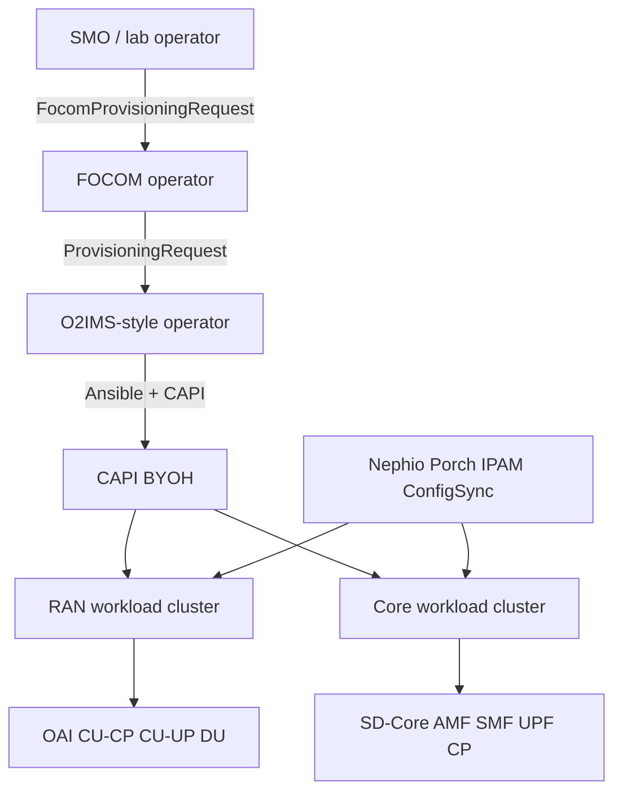
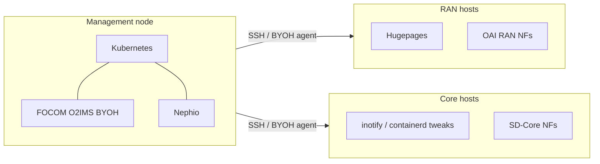

# LFN 5G Super Blueprint — Nephfon field set

Draft for submission as an LFN 5G SBP blueprint. Replace owner contact and GitHub URLs after the repo is created under the 5G SBP org.

## Blueprint Owner

**Sridhar K. N. Rao** <srao@linuxfoundation.org>, LF-ID: **sridharkn**. Student implementer: **Rehan Fazal** (original repos: `RehanFazal77/byoh-nephio`, `nephio-blueprints`, `nephio-management-config`). Student contact in source docs: mdrehanfazal326@gmail.com.

## User Stories

1. As an SMO / lab operator, I apply one `FocomProvisioningRequest` so that RAN and core Kubernetes clusters are created on my Linux servers without a public cloud.
2. As an O-Cloud integrator, I see provisioning state (`pending` / `progressing` / `fulfilled`) on O2IMS-style `ProvisioningRequest` objects.
3. As a 5G integrator, I deploy OpenAirInterface RAN (CU-CP, CU-UP, DU) on the RAN cluster using Nephio PackageVariants.
4. As a 5G integrator, I deploy Aether SD-Core (AMF, SMF, UPF, control-plane NFs) on the core cluster using the same Nephio management plane.
5. As a lab admin, I choose VLAN trunk (`networking-mode: vlan`) or physical NIC (`nic`) attachment for 3GPP interfaces without rewriting NAD JSON by hand.
6. As a 5G SBP consumer, I clone one Git repository (`Nephfon`) and follow a single README for FOCOM then NFO.

## Interaction with other open source projects and components

| Project | Interaction |
|---------|-------------|
| **Nephio** (LFN) | Management cluster: Porch, PackageVariants, IPAM, NAD specializers, Config Sync |
| **Cluster API + BYOH** (CNCF / VMware Tanzu) | Bare-metal workload cluster provisioning |
| **O-RAN Alliance WG6** | FOCOM NBI and O2IMS ProvisioningRequest concepts (inspired mapping; see `focom/docs/architecture.md`) |
| **OpenAirInterface** | RAN CU-CP, CU-UP, DU operators and NFs |
| **Aether / OMEC SD-Core** | 5G core NFs |
| **Multus CNI** | Secondary networks for N2/N3/N4/E1/F1 |
| **Calico** | Primary CNI on BYOH clusters (FOCOM path) |
| **kpt / Porch** | Blueprint render and publish |
| **Ansible** | Host registration and RAN/core node prerequisites |
| **Kubernetes** | Management and workload clusters (documented v1.32) |

## Resources — people

| Role | Who | Notes |
|------|-----|--------|
| Blueprint owner | Sridhar K. N. Rao <srao@linuxfoundation.org> (LF-ID: sridharkn) | SBP submission, LFN org |
| Primary implementer | Rehan Fazal (student) | Operators, kpt packages, lab bring-up |
| Review / claim check | Cursor-assisted code review (this consolidation) | Not a substitute for a witnessed lab demo |
| Upstream communities | Nephio, OAI, OMEC, CAPI BYOH | Images, CRDs, operators |

Add LFN 5G SBP mentors and lab hosts when assigned.

## Steps to Realization

1. **Lab hardware** — One management server (4+ CPU, 8+ GB RAM) plus RAN and core hosts with SSH and data-plane NICs.
2. **FOCOM** — Clone this repo; edit `focom/input.json`; run `focom/mgmt.sh`; apply `focom/examples/focom-all-clusters.yaml`; wait for CAPI clusters Ready.
3. **Nephio** — Install Nephio on the management cluster (`focom/README.md` init script / [Nephio install guide](https://docs.nephio.org/docs/guides/install-guides/)).
4. **GitOps repos** — Register Porch Repository CRs: upstream `directory: /nfo-blueprints` on this Git repo; downstream `ran` and `core` deployment repos (can be empty Git repos in the same org).
5. **NFO foundation** — Apply `nfo-management/clusterconfig`, `prerequisites`, baseline, addons, Multus, vlan-agent.
6. **NFO workloads** — Apply OAI PackageVariants then SD-Core PackageVariants; approve Porch revisions with `porchctl`.
7. **Validate** — RAN pods in `oai-ran-*` namespaces; core pods in `sdcore5g-*`; NADs show expected `master` (VLAN or NIC).
8. **SBP packaging** — Push to 5G SBP GitHub; publish `nad-master-fn` image to an LFN-owned registry; record a demo.

## High-level architecture diagram

## High-level lab topology diagram

Typical documented stack: Ubuntu 22.04, Kubernetes v1.32, Nephio R5, OAI-RAN v2.3.0.

## Dependencies — future releases of a specific component

| Dependency | Risk |
|------------|------|
| Nephio Porch / catalog (e.g. porchctl v1.5.7 in docs) | PackageRevision APIs and catalog paths change across Nephio releases |
| CAPI BYOH provider | API group `infrastructure.cluster.x-k8s.io` compatibility with CAPI version used by `mgmt.sh` |
| Kubernetes 1.32 + kubeadm | Newer K8s may break BYOH bootstrap or pause image pins |
| Bitnami → `bitnamilegacy` images | Further registry moves will break SD-Core Kafka/Mongo/Zookeeper |
| OAI RAN v2.3.0 operators | Newer OAI operator CRDs may not match these kpt packages |
| Aether SD-Core / OMEC images | Version drift vs Nephio R4-era packages still mentioned in some nested READMEs |
| Personal Docker Hub `rehanfazal47/nad-master-fn:v2.0` | Must be mirrored; not an LFN artifact yet |
| O-RAN FOCOM/NFO NBI | This code does **not** wait on a future Porch FOCOM NBI; aligning with Nephio FOCOM NBI ([issue 1066](https://github.com/nephio-project/nephio/issues/1066)) is a future dependency if SBP wants spec-faithful FOCOM |

## High-level timeline

| Phase | Duration (indicative) | Outcome |
|-------|----------------------|---------|
| T0 | Done (student) | FOCOM BYOH LCM + NFO OAI/SD-Core packages |
| T1 | 1–2 weeks | Monorepo on 5G SBP org; URL and image retarget; LICENSE/NOTICE |
| T2 | 1 lab week | Witnessed FOCOM cluster create + NFO NF Ready (screenshot/video) |
| T3 | 2–4 weeks | SBP wiki page, architecture slides, build guide from existing markdown |
| T4 | Ongoing | Optional: Porch-backed FOCOM NBI; LFN-hosted `nad-master-fn`; UE/traffic demo |

## Upstreaming Opportunities

- Contribute `nad-master-fn` (or equivalent) to Nephio/kpt function catalog to fix NAD JSON truncation.
- Contribute `vlan-agent` as a replacement for Nephio docs’ manual `vlan-interfaces.sh`.
- Align FOCOM operator with Nephio FOCOM NBI (Git/Porch draft-propose-approve) instead of hostPath `input.json`.
- Offer BYOH + O2IMS-style ProvisioningRequest samples to Nephio O-RAN integration docs.
- Push bitnamilegacy / kube-rbac-proxy image fixes into Nephio SD-Core catalog packages.
- OAI package-variant cleanup so nested READMEs match the management PackageVariants.

## Blueprint Outputs

**Code / repos**

- This monorepo (target: LFN 5G SBP GitHub org, name `Nephfon`).
- Prior student repos (provenance):  
  - https://github.com/RehanFazal77/byoh-nephio  
  - https://github.com/RehanFazal77/nephio-blueprints  
  - https://github.com/RehanFazal77/nephio-management-config  

**Documentation (build guide / slideware)**

- Build / deploy: `focom/README.md`, `nfo-management/README.md`
- Architecture / slides source: `focom/docs/architecture.md`, this file
- No separate slide deck (pptx) was found in the source trees

**Demo / video**

- None in-repo. Record after T2 lab witness. Related background (not this blueprint): Nephio O-RAN docs and LFN Nephio talks.

**Suggested SBP artifacts to add**

- One 5–8 minute demo video (FOCOM apply → cluster Ready → OAI/SD-Core pods)
- Slideware distilled from mermaid diagrams above
- SBOM / image list for the operators and NF containers
